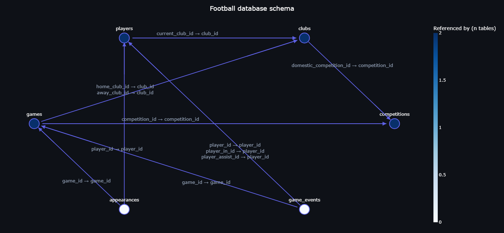
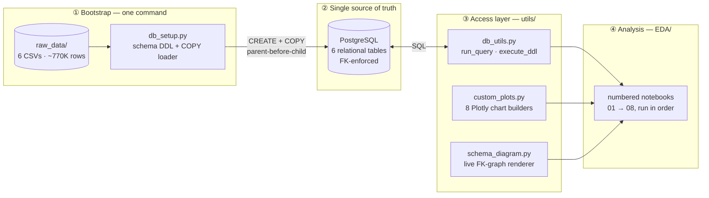
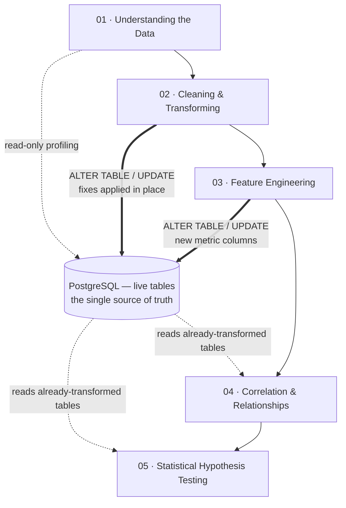
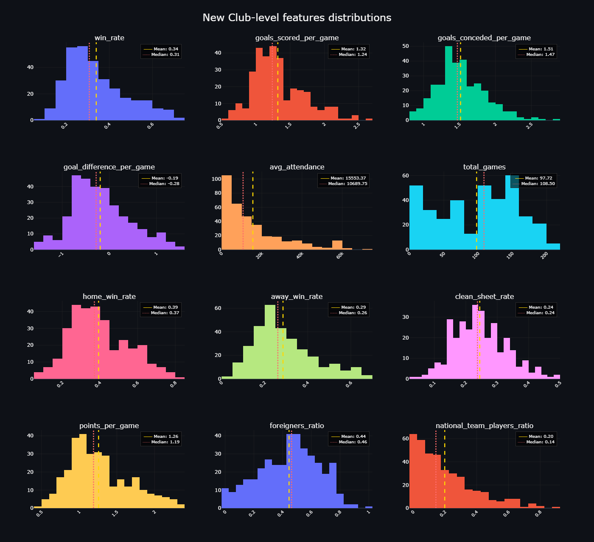
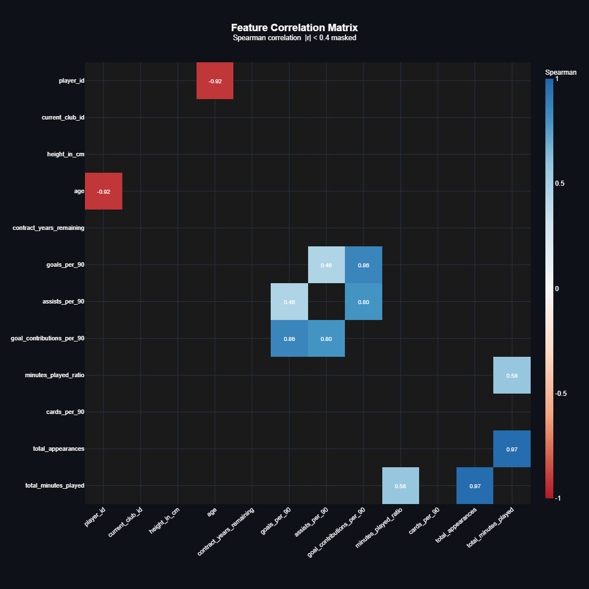
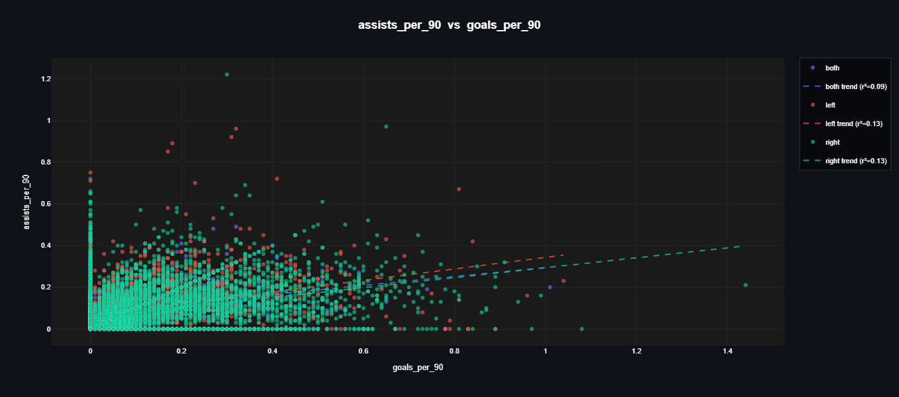

<div align="center">

# ⚽ Advanced EDA — Football Analytics on a Live PostgreSQL Database

**A database-first exploratory data analysis of European football:
770,000+ rows across 6 relational tables — profiled, cleaned, feature-engineered,
and statistically tested entirely through SQL against a live PostgreSQL instance.**

<br>


<br>



*The database schema — not a hand-drawn picture, but a live render produced by the project's own
`schema_diagram` utility, which introspects `pg_catalog` and draws the foreign-key graph with NetworkX + Plotly.*

</div>

---

## 🏗️ Why this project is built differently

Most EDA portfolio projects load a CSV into pandas and go from there. This one doesn't:

> **A custom database bootstrapper builds a real PostgreSQL database from the raw CSVs — schema,
> foreign keys, and bulk load in one command — and from that point on, every single step of the
> analysis runs as SQL queries against that live database. The database, not a DataFrame, is the
> single source of truth.**



### The bootstrapper — `db_setup.py`

A self-contained, zero-external-dependency CLI that drops, recreates, and reloads the entire
database from `raw_data/*.csv`:

- **Destructive-action guard** — detects whether the database already exists and requires an
  explicit `yes` before wiping anything; answering `no` leaves the cluster untouched.
- **Dependency-ordered schema** — tables are created and loaded parent-before-child so every
  foreign key resolves on first load.
- **Fast bulk ingest** — CSVs stream into Postgres via `COPY` through an in-memory
  tab-separated buffer (with a `float_format='%.0f'` guard so integer columns containing NaNs
  don't silently become `186.0`).
- **Reusable by design** — retargeting the script to a completely different dataset means
  changing exactly two constants: `SCHEMA_SQL` and `CSV_TABLE_MAPPING`.
- Hand-rolled ANSI spinners and per-table progress feedback — no `rich`, no `tqdm`.

### The database is where the work happens

Notebooks never pass cleaned DataFrames to each other. Instead, cleaning and feature
engineering are applied **in place** with `ALTER TABLE` / `UPDATE`, and every later notebook
reads the already-transformed tables straight from Postgres:



This mirrors how analytics actually works in production — transformations live in the
warehouse, analysis is a query away, and any notebook can be re-run against the current state
of the data without a fragile chain of intermediate files.

---

## 🗃️ The dataset

European football data (competitions, clubs, players, games, appearances, and in-game events)
covering **seasons 2020–2023**, sourced from [Quera's problemset](https://quera.org/problemset/237892).

| Table          |    Rows | What it holds                                          |
| -------------- | ------: | ------------------------------------------------------ |
| `appearances`  | 523,238 | One row per player per game — goals, assists, minutes, cards |
| `game_events`  | 215,954 | In-game events — goals, substitutions, cards, minute by minute |
| `games`        |  17,981 | Fixtures with scores, stadium, and attendance          |
| `players`      |  15,360 | Bios, positions, dominant foot, height, contracts      |
| `clubs`        |     426 | Squads, stadiums, and transfer balances                |
| `competitions` |      43 | Domestic leagues, domestic cups, and international cups |

Six tables, fully related through enforced foreign keys — which is exactly what makes a
relational database the right home for it.

---

## 🔬 The analysis pipeline

Every notebook in [EDA/](EDA/) is one stage of a deliberate arc: **understand → clean →
enrich → explore → prove → judge → explain → communicate.**

| #  | Notebook | What happens there | Status |
| -- | -------- | ------------------ | :----: |
| 01 | [Understanding the Data](EDA/01_understanding_the_data.ipynb) | Read-only profiling of all 6 tables — schema graph, distributions, outlier layouts, missing values, and a cleaning opportunity list | ✅ |
| 02 | [Cleaning & Transforming](EDA/02_cleaning_transforming_pipeline.ipynb) | Fixes applied in place via SQL: parse `net_transfer_record` strings (`+€1.8m`) into a numeric column; replace impossible heights with the median. Just as deliberately, *declines* to "fix" `-1` event minutes — they encode shootout events, and imputing them would bias any timing analysis | ✅ |
| 03 | [Feature Engineering](EDA/03_feature_engineering_pipeline.ipynb) | 20+ analysis-ready columns added to the live tables: per-90 player metrics (`goals_per_90`, `assists_per_90`, `cards_per_90`…), club performance rates (`win_rate`, `points_per_game`, `clean_sheet_rate`…), and game outcome flags — with minimum-minutes thresholds so one-game wonders can't masquerade as elite performers | ✅ |
| 04 | [Correlation & Relationships](EDA/04_correlation_relationship_analysis.ipynb) | Exploratory, not confirmatory: correlation heatmaps, cross-tabulations, and grouped comparisons. Interesting patterns get flagged — **no conclusions drawn here, only observations** that become hypotheses for notebook 05 | ✅ |
| 05 | [Statistical Hypothesis Testing](EDA/05_statistical_hypothesis_testing.ipynb) | Formal testing of the flagged patterns: Shapiro-Wilk normality checks first (all player metrics are right-skewed → non-parametric tests), then Kruskal-Wallis, chi-square, and more — always reporting effect sizes (η², Cramér's V) alongside p-values | 🔄 |
| 06 | KPI Design & Analysis | Judgment metrics, not just features: squad efficiency, home-advantage index, scoring dependency, competitiveness index | 🔜 |
| 07 | Root Cause Analysis | One non-obvious, statistically confirmed finding investigated in depth — candidate explanations stated up front, then tested against the data | 🔜 |
| 08 | Final Non-Technical Report | The payoff: plain-language findings for a non-technical reader — no code, no jargon, charts and takeaways only | 🔜 |

✅ complete  🔄 in progress  🔜 planned

---

## 📊 Selected visuals

All charts come from the project's own plotting library and share one dark visual identity.

<div align="center">



*Notebook 03 — every engineered club metric sanity-checked at a glance: 12 distributions with mean/median overlays, one `distribution_plot()` call.*

<br><br>



*Notebook 04 — Spearman correlation matrix with |r| &lt; 0.4 masked, so only relationships worth investigating survive.*

<br><br>



*Notebook 04 — goals vs assists per 90, split by dominant foot, with per-group OLS trend lines and r² annotations.*

</div>

---

## 🧰 The toolkit — `utils/`

Clean, typed, reusable modules instead of copy-pasted notebook cells.

### `custom_plots.py` — one visual language for the whole project

Eight chart builders, each taking a DataFrame and returning a `plotly.graph_objects.Figure`
on a shared dark theme:

| Function | Purpose |
| -------- | ------- |
| `distribution_plot` | Multi-column histogram grids with mean/median overlays |
| `box_plot` | Outlier layouts, vertical or horizontal |
| `cross_tab_heatmap` | Categorical × categorical association views |
| `correlation_heatmap` | Pearson/Spearman matrices with threshold masking |
| `scatter_plot` | Bivariate views with per-group OLS trend lines + r² |
| `bubble_plot` | Trivariate views with size encoding |
| `grouped_bar_plot` | Grouped categorical comparisons |
| `grouped_box_plot` | Distribution comparisons across groups |

### `db_utils.py` — the only door to the database

A singleton SQLAlchemy engine behind two functions, so every notebook talks to Postgres the
same way:

```python
from utils.db_utils import run_query, execute_ddl

df = run_query("SELECT position, AVG(goals_per_90) FROM players GROUP BY position")
execute_ddl("ALTER TABLE clubs ADD COLUMN win_rate NUMERIC")  # auto-commit, rollback on error
```

### `schema_diagram.py` — the live FK graph

Renders the hero image above by introspecting the running database. It deliberately queries
**`pg_catalog` instead of `information_schema`**: Postgres constraint names are only unique
per table, so `information_schema` joins on constraint names produce phantom duplicate edges —
`pg_catalog` OIDs don't.

---

## 📐 Statistical discipline

The rules the analysis holds itself to:

- **Assumptions are checked, not assumed** — normality (Shapiro-Wilk) and variance homogeneity
  decide which test gets used, parametric or non-parametric.
- **Effect sizes always accompany p-values** — η², Cramér's V, r². Significant ≠ meaningful.
- **Correlation is never sold as causation** — exploratory findings are worded as associations
  and promoted only after formal testing.
- **Thresholds are stated explicitly** — what counts as an outlier or "sufficient minutes" is
  written down, never silently chosen.
- **Small samples and multiple comparisons get flagged** before a result is presented as reliable.

---

## 🚀 Getting started

**Prerequisites:** Python 3.13, a running PostgreSQL server, and these packages:
`psycopg2 sqlalchemy pandas numpy scipy plotly networkx python-dotenv`

**1 — Clone** (the raw CSVs are included — no downloads needed):

```bash
git clone https://github.com/arianmokhtariha/Advanced-EDA.git
cd Advanced-EDA
```

**2 — Configure** a `.env` file in the project root:

```env
DB_USER=postgres
DB_PASSWORD=your_password
DB_HOST=localhost
DB_PORT=5432
DB_NAME=football
```

**3 — Bootstrap the database** (asks for confirmation before touching anything):

```bash
python db_setup.py
```

**4 — Run the analysis:** open the notebooks in [EDA/](EDA/) in numeric order. Notebooks 02
and 03 mutate the database in place, so first runs should go top-to-bottom, in sequence.

---

## 📁 Project structure

```
Advanced-EDA/
├── raw_data/                  # source CSVs (committed — clone & go)
├── db_setup.py                # database bootstrapper: schema + COPY load
├── db_config.py               # credentials from .env
├── utils/
│   ├── db_utils.py            # run_query / execute_ddl — the only DB door
│   ├── custom_plots.py        # 8 themed Plotly chart builders
│   └── schema_diagram.py      # live FK-graph renderer (pg_catalog)
├── EDA/
│   ├── 01_understanding_the_data.ipynb
│   ├── 02_cleaning_transforming_pipeline.ipynb
│   ├── 03_feature_engineering_pipeline.ipynb
│   ├── 04_correlation_relationship_analysis.ipynb
│   └── 05_statistical_hypothesis_testing.ipynb
└── assets/                    # README visuals, exported from the notebooks
```

---

## 🎯 Scope

This project is intentionally a **pure EDA** — the craft on display is data understanding,
statistical reasoning, and insight communication.

| In scope | Out of scope |
| -------- | ------------ |
| Exploratory analysis & profiling | Machine learning & predictive modeling |
| SQL transformations on live PostgreSQL | Clustering & segmentation |
| Hypothesis testing with effect sizes | Time-series forecasting |
| KPI design & root-cause analysis | External data sources & scraping |
| A final plain-language report | |
